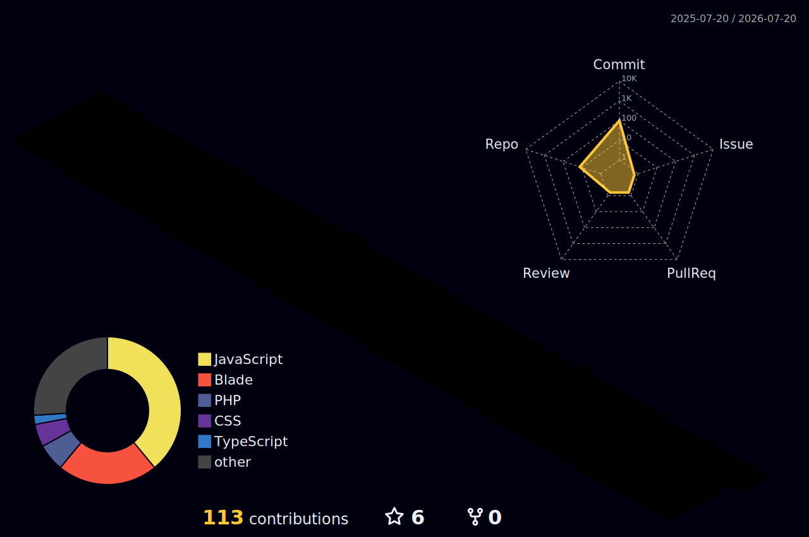

  

<h1 align="center">Hi 👋, I'm Fathur Rizky Assani</h1>
<h3 align="center">Undergraduate Student at Polytechnic Caltex Riau. Interested in backend development, especially PHP and Java.</h3>

- 🌱 I’m currently learning **Laravel 12** and **React**.

### Languages and Tools:

&nbsp;&nbsp;&nbsp;&nbsp;&nbsp;&nbsp;&nbsp;&nbsp;&nbsp;&nbsp;&nbsp;

 

<picture>
  <source media="(prefers-color-scheme: dark)" srcset="https://raw.githubusercontent.com/CallMeFG/CallMeFG/output/pacman-contribution-graph-dark.svg">
  <source media="(prefers-color-scheme: light)" srcset="https://raw.githubusercontent.com/CallMeFG/CallMeFG/output/pacman-contribution-graph.svg">
  
</picture>
